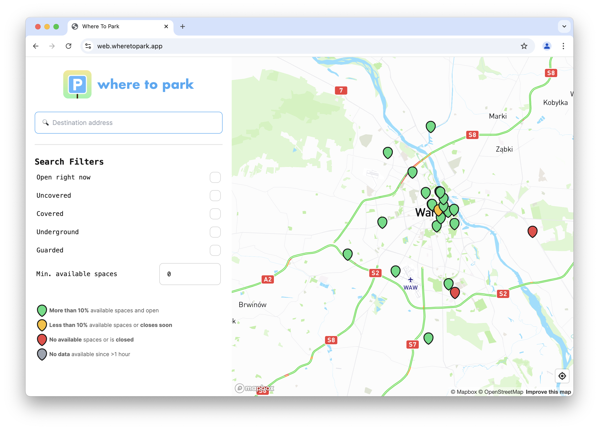
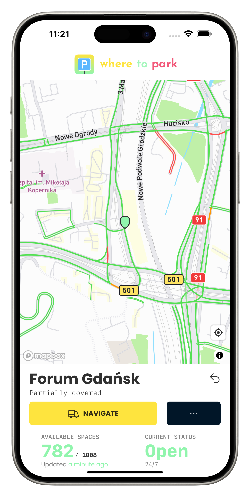
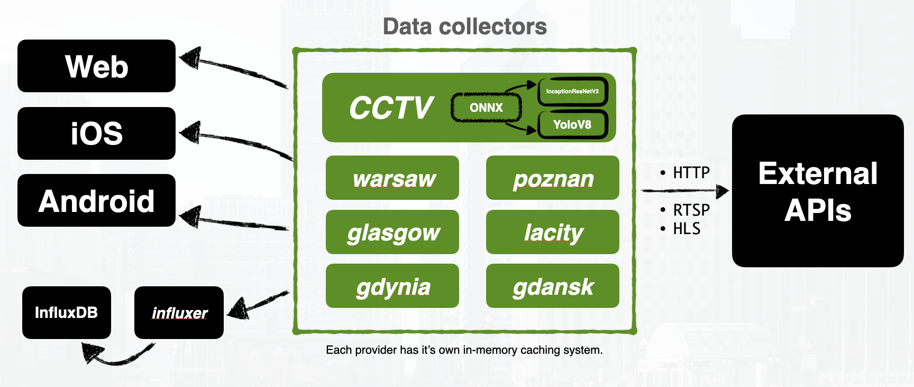

# [wheretopark.app](https://wheretopark.app)

[Where To Park](https://wheretopark.app) is an app that aims to help drivers to find parking spaces in big and crowded cities.

## Application

### Web app

Built with Svelte & SvelteKit.

Try it out at [web.wheretopark.app](https://web.wheretopark.app).

### iOS & Android

iOS was initially developed with Swift and SwiftUI, right now it works similarly as Android - the web app is compiled with [capacitor.js](https://capacitorjs.com) to work on mobile.

iOS app can be installed from [App Store](https://apps.apple.com/us/app/where-to-park/id6444453582).
Android app can be installed from [Google Play](https://play.google.com/store/apps/details?id=com.gbaranski.wheretopark&utm_source=wheretopark.app).

## Sources of real-time parking lot data 

In [wheretopark.app](https://wheretopark.app) I didn't want to rely on a single source of data, as these apps that do that usually end up either working like shit, or not working at all. Global vision allows for a bigger budget on these apps and more often they end up running for longer.

## Artificial Intelligence and CCTV cameras

Initial goal was to use CCTV cameras on all of parking lots, later I've discovered that it's very hard to get access to these cameras. 

However the AI model was already developed and working on a few parking lots.

That's how it works:

  
   

I connected cameras from cities such as:
- Gdańsk, Poland.
- Kłodzko, Poland.
- Lubin, Poland. 

## City APIs

A lot of cities in the world expose their existing parking lot systems to the public, parking meters, sensors, and gates with counters - in wheretopark.app we fetch these data sources, transform, and make available to Where To Park users.

Cities that we currently support are:
- Gdańsk, Poland.
- Gdynia, Poland.
- Sopot, Poland.
- Poznań, Poland.
- Warsaw, Poland.
- Glasgow, Scotland.
- Los Angeles, United States of America.

## Microservice architecture

Every provider/collector is a separate process, making everything scalable & fault tolerant. If one provider fails and crashes, the user just will not be able to see data from that one specific city, still being able to fetch other cities.

API providers often have problems with getting too many requests, that's why, in the app, only the first request is an actual request to the API, then the cache is stored with the data for 5 minutes, any further request is going retrieve data from the in-memory cache store, that every provider/collector has.

This approach results not only in less API requests when many users decide to use the app, but also when there's zero activity on the app - then there are zero requests sent.

## State of wheretopark.app

I had big plans with the app, winning many awards and speaking with the press. However the biggest struggle was to actually communicate with the cities, to get the camera access.
After almost 2 years, tens or hundreds of calls and emails I eventually gave up, leaving the project as-is, in a state where it's completely usable, probably even for commercial use.

I wrote [a blog post](https://gbaranski.com/wheretopark/) where I explain more on what happened.

**If you're interested in this project**, and you think you could possibly make it work somewhere. Reach out to me at [me@gbaranski.com](mailto:me@gbaranski.com), or through one of the ways [listed here](https://gbaranski.com/contact/). 
